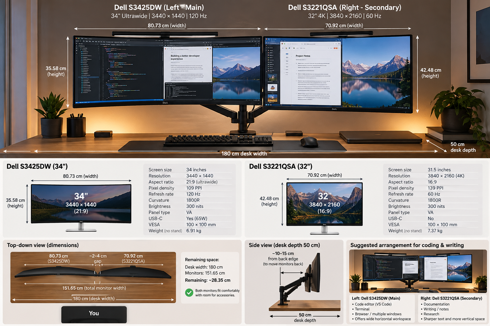
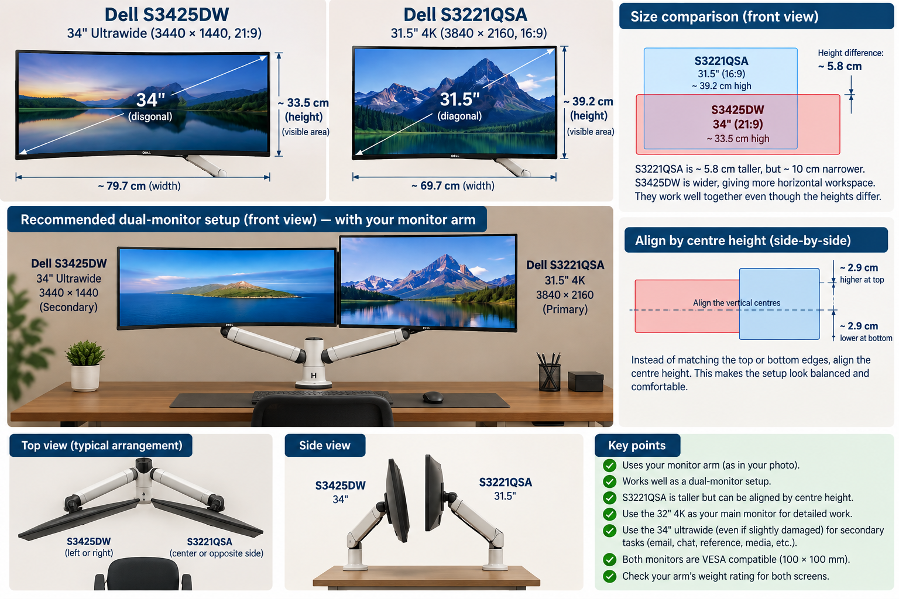

# 🖥️ Can ChatGPT Design Your Dream Desk?

**CVisiona POVs · Copy-and-paste prompts**

Plan your desk setup before buying a single thing—from choosing monitors and a monitor arm to seeing how everything looks together.

## How to use this guide

1. Tell ChatGPT your requirements and ask for recommendations.
2. Browse Amazon and pick products you like.
3. Come back to ChatGPT to compare your shortlist and check compatibility.
4. Ask for a visual layout from different angles.

**Start with your requirements. No inspiration image needed.** The desk illustration comes at the end, after you have selected the equipment.

Replace the details in `[brackets]` and use these prompts in the same conversation so ChatGPT can follow your choices.

> These prompts recreate the workflow shown in the video. They are not a verbatim transcript of the original conversation.

---

## 1 · Tell ChatGPT what you want

**Start here: your desk, your needs, your budget.**

```text
I want to build my ideal desk setup. My desk measures [width × depth] cm,
and my budget is [amount and currency]. I mainly use it for [coding,
writing, video editing, etc.].

I’d like two monitors, a dual monitor arm, good lighting, and tidy cable
management. I already own [equipment].

Can you recommend monitors and monitor arms that suit my needs, fit my
desk, and stay within my budget? Give me specific models to look for on
Amazon [country], with links where available.

Ask me any essential questions before making recommendations.
```

**Next:** Browse the recommendations on Amazon. Save the links to the products you like, then bring them back to the conversation.

---

## 2 · Compare the monitors you found

**Found a few options? Ask what the differences actually mean for you.**

```text
I found these two monitors on Amazon: [model 1] and [model 2].

Can you compare them? Explain the differences in screen size, resolution,
image sharpness, and actual width and height—not just the diagonal
measurement.

Which would work better as my main monitor for [activities]? Would they
work well together as a dual-monitor setup?

Here are the product links: [paste links].
```

### My example: [Dell S3425DW](https://amzn.to/4e3n0dh) + [Dell S3221QSA](https://amzn.to/4hN0kip)

**Check them out on Amazon:** [Dell S3425DW](https://amzn.to/4e3n0dh) · [Dell S3221QSA](https://amzn.to/4hN0kip)

*The Amazon storefront you reach depends on the link’s redirection settings. If it is not your local store, search the same model on Amazon in your country.*

```text
I found these two monitors on Amazon: Dell S3425DW and Dell S3221QSA.

Can you compare them? Explain the differences in screen size, resolution,
image sharpness, and actual width and height—not just the diagonal
measurement.

Which would work better as my main monitor for [activities]? Would they
work well together as a dual-monitor setup?

Here's my thinking:
left : [Dell S3425DW](https://amzn.to/4e3n0dh)
Right : [Dell S3221QSA](https://amzn.to/4hN0kip)

Give me a diagram show what you were thinking ? 

```

### What I got from ChatGPT: Desk Setup 1



*This is the illustration ChatGPT generated for my first dual-monitor comparison, before I selected the monitor arm. It shows the initial layout with the ultrawide as the main display.*

### Useful follow-up questions

- Why can a 31.5-inch monitor be taller than a 34-inch ultrawide?
- Which screen would be better for text, coding, and detailed work?
- How much horizontal space would the two monitors take up together?
- Should I align their top edges, bottom edges, or centres?
- Which monitor should be directly in front of me?

---

## 3 · Check the monitor arm and desk fit

**The gear looks good. Now check whether it works together.**

```text
I like this dual monitor arm: [Amazon link or model].

Can it support both [monitor 1] and [monitor 2]? Check their weight without
stands, VESA mounting, and the arm’s screen-size and weight limits.

My desk is [width × depth × thickness] cm, with [cm] of space behind it.
Will this arrangement fit, and can I adjust the monitors so they sit
comfortably next to each other?

Check the arm’s reach and clamp requirements too. Tell me if you need
any additional measurements before confirming compatibility. And show me how does it look like ? 
```

### My example: checking the selected arm

```text
I like this monTEK Dual Ultrawide Monitor Arm for 17–57-inch screens,
in white, with USB-A/C ports: https://amzn.to/4y9Y4rW

Can it support both the Dell S3425DW and Dell S3221QSA? Check their weight
without stands, VESA mounting, and the arm’s size and weight limits.

My desk is [width × depth × thickness] cm, with [cm] of space behind it.
Will this arrangement fit, and can I adjust the monitors so they sit
comfortably next to each other?

I want the main monitor directly in front of me and the secondary monitor
on the left, angled inward. Can this arm accommodate that arrangement?
```

---

## 4 · See the setup before you buy

**Turn your selected equipment into a visual concept.**

```text
Show me what these two monitors would look like together on my desk using
the monitor arm I selected.

Put [monitor 1] on the left as the secondary display and [monitor 2] on
the right as the primary display. Align their vertical centres, with
the primary display directly in front of my seated position.

Create a visual comparison showing each screen’s width and height,
followed by the complete setup from the front, top, and side. Keep the
same monitor arm and arrangement in every view.

Use [desk material and colour], [accessories], and [lighting style].
Use verified dimensions for the comparison and tell me if any
measurements are estimates.
```

### My example: the dual-monitor desk concept

```text
Show me what these two monitors would look like together on my desk using
the monitor arm I selected.

Put the Dell S3425DW on the left as the secondary display and the Dell
S3221QSA on the right as the primary display. Align their vertical
centres, with the primary display directly in front of my seated position.

Create a visual comparison showing each screen’s width and height,
followed by the complete setup from the front, top, and side. Keep the
same monitor arm and arrangement in every view.

Use a warm wood desk, a white dual monitor arm, a dark desk mat, a
keyboard and mouse, and a small plant. Keep the cables tidy and the
desktop uncluttered.

Use verified dimensions for the comparison and tell me if any
measurements are estimates.
```

### What I got from ChatGPT: Desk Setup 2



*After I shared the monitor arm, ChatGPT generated this revised concept: the 4K screen as the primary display, the ultrawide as the secondary, and their vertical centres aligned. These are ChatGPT’s generated illustrations; the dimensions and compatibility labels shown in them are not independently verified.*

### What the resulting illustration shows

| Element | My concept |
| --- | --- |
| Left display | [Dell S3425DW](https://amzn.to/4e3n0dh), labelled as a 34-inch ultrawide |
| Right display | [Dell S3221QSA](https://amzn.to/4hN0kip), labelled as a 31.5-inch 4K display |
| Screen arrangement | Side by side, with vertical centres aligned |
| Mount | [monTEK Dual Ultrawide Monitor Arm](https://amzn.to/4y9Y4rW), white, with USB-A/C ports |
| Desktop | Warm wood finish |
| Accessories | Dark desk mat, keyboard, mouse, and a small plant |
| Views | Front, top, and side, plus a screen-size comparison |

The illustration is the **output of this process**, not an image you need to upload at the beginning.

> **Quick fit check:** Generated visuals help you picture the result. Confirm the exact product specifications and physical clearances before buying; an illustration alone does not prove that the equipment fits.

---

## Keep refining it

Try these follow-ups once you have a first visual:

```text
Show the same setup with the secondary monitor angled further inward.
Keep the equipment and mounting point unchanged.
```

```text
Show me a clearer top view with the desk depth, monitor positions,
and my seated position labelled.
```

```text
Compare centre alignment with top-edge alignment using the same monitors.
```

```text
Simplify the desk styling and show where the cables would run underneath.
```

---

**Your requirements → Recommendations → Amazon shortlist → Comparison → Fit check → Visual concept**

---

## Support CVisiona

If this guide helped you, you can support independent tech media by sponsoring the work on GitHub.

<a href="https://github.com/sponsors/cloudmelon"></a>

*CVisiona · Practical technology, clearly explained.*
